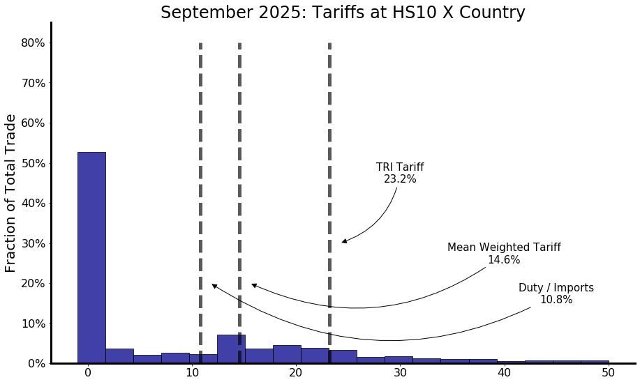

# How Restrictive is U.S. Trade Policy?

<p float="left" align="middle">
   
</p>

This repository contains the code and data infrastructure for computing Trade Restrictiveness Indices (TRI) and alternative tariff measures for U.S. imports. This work is associated with the paper **"How Restrictive is U.S. Trade Policy?"** by Michael E. Waugh, available at: https://www.waugheconomics.com/uploads/2/2/5/6/22563786/how-restrictive-us-tradepolicy.pdf

## Overview

The repository implements methods to:
- Download and process U.S. import data at the HS10 commodity level from the U.S. Census Bureau
- Calculate various tariff measures including:
  - **TRI (Trade Restrictiveness Index)**: A weighted root-mean-square tariff measure
  - **Weighted Mean Tariff**: Import-weighted average tariff
  - **Simple Mean Tariff**: Ratio of total duties to total import values
- Compute these measures across countries and sectors over time
- Generate visualizations and LaTeX outputs for publication

## Repository Structure

```
.
├── make-imports-hs10-dataset.ipynb  # Data download and preparation
├── TRI-all-country.ipynb            # Country-level TRI calculations
├── TRI-sector.ipynb                 # Sector-level TRI calculations
├── data/
│   ├── country-list-20.csv          # List of top 20 trading partners
│   ├── country-list.csv             # Extended country list
│   ├── unique_commodities.csv       # HS10 commodity reference
│   └── imports-hs10/                # Downloaded import data (parquet files)
├── README.md
└── LICENSE
```

## Data Source

All import data is retrieved from the **U.S. Census Bureau International Trade API**:
- API Endpoint: `https://api.census.gov/data/timeseries/intltrade/imports/`
- Data includes:
  - HS10-level commodity codes
  - Monthly import values (CON_VAL_MO)
  - Calculated duties (CAL_DUT_MO)
  - Country codes and names
  - Data from 2013 onwards

## Workflow

### 1. Data Collection (`make-imports-hs10-dataset.ipynb`)

This notebook downloads HS10-level U.S. import data from the Census Bureau API.

**Key steps:**
1. Identifies top 31 trading partners by total import value
2. Downloads monthly HS10 import data for each country from 2013-01 onwards
3. Stores data in Parquet format in `data/imports-hs10/` directory
4. Creates separate files for:
   - Each individual country (e.g., `5700data-current.parquet` for China)
   - Total imports across all countries (`TOTALdata-current.parquet`)

**Usage:**
```python
# Run all cells in make-imports-hs10-dataset.ipynb
# Output: Parquet files saved to data/imports-hs10/
```

**Note:** The notebook uses a public API key. For heavy usage, obtain your own key from the Census Bureau.

### 2. Country-Level Analysis (`TRI-all-country.ipynb`)

Calculates TRI and alternative tariff measures aggregated across all trading partners.

**Key functions:**

- `make_tariff_country_date(dfcntry, date)`: Extracts tariff data for a specific date
- `make_good_country_year(dfcntry, year)`: Aggregates commodity-level data by year
- `process_countries_for_date(country_list, target_date, weight_year)`: 
  - Processes multiple countries
  - Calculates import weights based on a reference year
  - Returns combined dataset ready for TRI calculation

**Tariff Measures Computed:**

1. **TRI Tariff (sqrtariff)**: 
   $$\text{TRI} = \sqrt{\sum_{i} w_i \tau_i^2}$$
   where $w_i$ are import weights and $\tau_i$ are tariff rates

2. **Weighted Mean Tariff**: 
   $$\bar{\tau} = \sum_{i} w_i \tau_i$$

3. **Simple Mean Tariff**: 
   $$\text{Simple Mean} = \frac{\sum \text{Duties}}{\sum \text{Imports}}$$

**Outputs:**
- LaTeX macros saved to `results.tex` for paper integration
- Time series plots of tariff measures
- Histograms showing distribution of tariffs across commodities
- Country-specific TRI calculations

**Example Usage:**
```python
target_date = "2025-09"
bigdf = process_countries_for_date(country_list, target_date, weight_year="2024")
sqrtariff = ((bigdf["tariff"]**2 * bigdf["weights"]).sum())**0.5
print(f"Weighted TRI Tariff: {sqrtariff:.2%}")
```

### 3. Sector-Level Analysis (`TRI-sector.ipynb`)

Computes TRI measures disaggregated by HS2-level sectors (e.g., machinery, textiles, chemicals).

**Key features:**
- Identifies top 10-20 sectors by import value
- Maps HS2 codes to descriptive sector names
- Excludes special classification codes (98, 99) and specific sectors (27, 71)
- Calculates sector-specific TRI measures over time

**Function:**
- `process_sectors_for_date(country_list, hscode, target_date, weight_year)`:
  - Filters to specific HS2 sector
  - Processes all countries within that sector
  - Returns sector-specific tariff metrics

**Outputs:**
- Sector-by-sector TRI calculations
- Comparative visualizations across sectors
- LaTeX table output to `table-sector.tex`

## Requirements

```python
pandas
matplotlib
numpy
scipy
requests
pyarrow
```

## Installation

1. Clone the repository:
```bash
git clone https://github.com/yourusername/how-restrictive-us-trade.git
cd how-restrictive-us-trade
```

2. Install dependencies:
```bash
pip install pandas matplotlib numpy scipy requests pyarrow
```

3. Run the notebooks in order:
   - First: `make-imports-hs10-dataset.ipynb` (downloads data)
   - Then: `TRI-all-country.ipynb` and/or `TRI-sector.ipynb` (compute metrics)

## Configuration Notes

The notebooks contain hardcoded file paths specific to the development environment. Before running, update the following paths in each notebook:

**In `TRI-all-country.ipynb` and `TRI-sector.ipynb`:**
```python
country_list = pd.read_csv("C:\\heroku\\median-tariff\\data\\country-list-20.csv", ...)
figfile = "C:\\github\\how-restrictive-us-trade\\figures\\"
texfile = "C:\\github\\how-restrictive-us-trade\\results.tex"
```

Update these to match your local directory structure.

## Key Concepts

### Trade Restrictiveness Index (TRI)
The TRI is a theoretically-motivated measure of trade restrictiveness that accounts for the dispersion of tariffs across commodities. Unlike simple averages, it captures how the variance in tariff rates affects trade patterns. Higher TRI values indicate more restrictive trade policies, with the gap between TRI and weighted mean tariff reflecting the degree of tariff dispersion.

### Import Weights
Weights are calculated based on import values from a reference year (typically 2024) to avoid endogeneity bias where tariff changes directly affect contemporaneous import values.

### HS10 Classification
The Harmonized System (HS) is an international nomenclature for the classification of products. HS10 is the most detailed level used by U.S. Customs, providing approximately 16,000+ distinct product categories.

## Citation

If you use this code or data, please cite:

```
Waugh, Michael E. "How Restrictive is U.S. Trade Policy?"
Available at: https://www.waugheconomics.com/uploads/2/2/5/6/22563786/how-restrictive-us-tradepolicy.pdf
```

## License

This project is licensed under the MIT License - see the [LICENSE](LICENSE) file for details.

## Contact

For questions or issues, please open an issue on the GitHub repository or contact the paper author through the website linked above.

## Acknowledgments

Data sourced from the U.S. Census Bureau's International Trade API. Special thanks to the Census Bureau for providing public API access to this valuable trade data.
