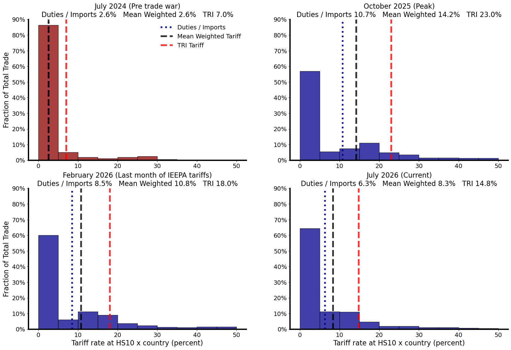

# How Restrictive is U.S. Trade Policy?

<p float="left" align="middle">
  
</p>

Code, data pipeline, and the paper itself for **"How Restrictive is U.S. Trade
Policy?"** by Michael E. Waugh. The current PDF is
[paper/how-restrictive-us-tradepolicy.pdf](paper/how-restrictive-us-tradepolicy.pdf);
the interactive tracker built from the same numbers is at
https://www.tradewartracker.com.

## What it computes

Three tariff measures from the U.S. Census Bureau's HS10-by-country import
data (values and duties collected), monthly from 2024 on, for 30 trading
partners, for the aggregate, by HS2 sector, and by end-use category:

| Measure | Formula | Column |
|---|---|---|
| **TRI** (Trade Restrictiveness Index) | $\sqrt{\sum_g w_g \tau_g^2 / \sum_g w_g}$ | `sqrtariff` |
| **Mean weighted tariff** | $\sum_g w_g \tau_g / \sum_g w_g$ | `meanweighted` |
| **Duties / imports** | $\sum_g \text{duties}_g / \sum_g \text{value}_g$ | `simplemean` |

where a good $g$ is an HS10 code by country, $\tau_g$ is duties collected
over import value in the month (the *de facto* applied tariff), and the
weights $w_g$ are the good's import value over calendar 2024, normalised
within whatever is being measured. The TRI is the uniform tariff with the
same deadweight loss as the actual tariff structure; the gap between it and
the mean is the cost of dispersion. See the paper for the derivation.

## Repository layout

```
tri/                      the package: one definition of the loader, weights, measures, tex writers, plot helpers
scripts/
  build_panel.py          31 input files -> data/panel/tariff-panel.parquet   (once per data vintage, ~6 s)
  build_metrics.py        panel -> data/metrics/*.parquet                     (every series, ~12 s)
  build_paper_inputs.py   metrics -> paper/results*.tex, table*.tex
tests/                    the refactor gate (reproduces tests/baseline-2026-07/) and formula checks
TRI-all-country.ipynb     read data/metrics, check, draw the histograms and country panels
TRI-sector.ipynb          ... the sector panels
TRI-composition.ipynb     ... the end-use panel
TRI-tracker-update.ipynb  ... the daily series for the tracker app
data/
  imports-hs10/           the 33 input files, built by ../trade-data (30 countries + EU + USMCA + TOTAL)
  metrics/                every series the paper and tracker use (committed)
  country-list.csv        the 30 countries; country-list-20.csv the top 20
  hs6-enduse.parquet      HS6 -> BEC end-use category
paper/                    the LaTeX source, generated fragments, figures, PDF
DATA-PIPELINE.md          the monthly update, step by step
REFACTOR-PLAN.md          design of the pipeline and its verification record
```

## Data

The input files come from the canonical dataset in the sibling repo
`../trade-data` (Census International Trade API, HS10, 2013 → present,
validated). This repository downloads nothing; its data stage is "run trade-data's
build, then its notebook 04", which writes `data/imports-hs10/` here. Details
and the API reference are in `DATA-PIPELINE.md`.

## Running it

```bash
pip install pandas numpy pyarrow matplotlib pytest
python scripts/build_panel.py
python scripts/build_metrics.py
python -m pytest tests -q
python scripts/build_paper_inputs.py --target 2026-07
```

Then open the notebooks from the repository root (paths are relative to it),
set `target_date`, and Run All; each takes a few seconds. Their check cells
refuse to plot if `data/metrics/` is not at the target month or was built with
a different weight mode.

## Choices worth knowing

- **Weights are calendar-2024 import values** (`tri/config.py: WEIGHT_YEAR`).
  Through the July 2026 vintage the notebooks used January 2024 only; the
  switch and what it moved are recorded in `paper/weights-change-2026-07.md`.
- **Weights renormalise within the grouping**: a country's TRI uses that
  country's import shares, a sector's TRI the shares within the sector.
- **The denominator runs over every good that had weight in 2024**; a good
  absent in a month counts as tariff-free. `weight_coverage` in every metrics
  file reports how much weight is present. `--renormalize present` divides by
  the present goods instead.
- **Sectors** exclude HS2 27 (petroleum), 71 (precious metals), 98 and 99;
  sector and end-use measures run over the top-20 partners.
- The country table's "All Countries" row is the top-20 aggregate; the prose
  quotes the 30-country aggregate.

## Citation

```
Waugh, Michael E. "How Restrictive is U.S. Trade Policy?"
https://github.com/tradewartracker/how-restrictive-us-trade
```

## License

MIT — see [LICENSE](LICENSE). Data sourced from the U.S. Census Bureau's
International Trade API.
